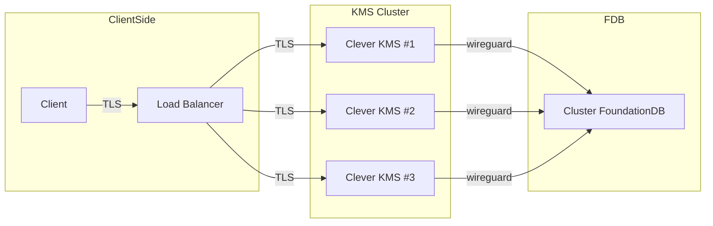

Customers often asks us for a native solution to store and protect their secrets, in a secure, convenient and resilient way. Clever KMS is our answer to this need. It was built in collaboration with a client with specific security requirements, but we designed it so that it could also meet our own needs and those of any user of Clever Cloud platform.

As with our Materia database offering, it's built on top of the open-source transactional database [FoundationDB](https://www.foundationdb.org/), widely used by Apple to store their metadata, which gives us strong guarantees on data reliability and a full‑fledged transactional model, allowing us to create a serverless multi‑tenant database. We developed compatibility layers with existing ecosystems such as HashiCorp Vault and Bao.

> [!NOTE] Clever KMS is in private access
> Ask for activation to your sales representative or [Clever Cloud support](https://console.clever-cloud.com/ticket-center-choice)

## Architecture

Because of the distributed nature of Materia, Clever KMS is always up, which is crucial for a secrets‑management tool. All data in transit is fully encrypted with TLS until it reaches one of the Clever KMS nodes, where the TLS termination occurs. Each node is connected to FoundationDB through [WireGuard](https://www.wireguard.com/). At rest, your data is stored using the state‑of‑the‑art cryptographic cipher [XChaCha20‑Poly1305](https://en.wikipedia.org/wiki/ChaCha20-Poly1305). This ensures that your data is never accessible to third parties, either in transit or at rest.

Powered by Materia and modern cryptography, Clever KMS provides a secure, reliable, and resilient platform able to store your keys, certificates, and sensitive data.



## Prerequisites

To use Clever KMS you'll need :
- An authorized access for your organisation
- Clever Tools with KMS commands
- A compatible Vault CLI

To check if you have access to Clever KMS for your organisation, run the following command in your terminal:

```bash
clever features enable kms
clever kms --org <your_org_id>
```

## Create a Clever KMS add‑on

To create a Kubernetes cluster, use the Console or the following command in Clever Tools:

```bash
clever addon create kms myKMS --org <your_org_id>
```

The add-on is immediately created and you can start using it. You will receive two tokens, based on [Eclipse Biscuit](https://biscuitsec.org/):

- Root token: for administrative tasks
- User token: for day‑to‑day tasks

You can  use HTTP API compatible with Vault, or any compatible client such as [Hashicorp Vault CLI](https://developer.hashicorp.com/vault/docs/commands). Such tools will need the KMS endpoint exported as `VAULT_ADDR` environment variable:

```bash
export VAULT_ADDR="https://kms.eu-fr-1.services.clever-cloud.com:8200"
```

First step is to login with root token and initialize your vault, this will display your unseal shares.:

```bash
❯ vault login
❯ vault operator init

Unseal Key 1: AQcEUzVTOmXm8O-lQavD4lCPKRTdXiwQAokb_uA2GjmJ
Unseal Key 2: AjoHPHK1ixLe5Dr9gV4STroKv_Kk3oHIQX_x-vAmo1xN
Unseal Key 3: A2GogTjZ617v85dV-C89TihYEV9C5AS8C3n1jz0aZCDC
Unseal Key 4: BPd1uTtjoel0VU4-Zkq3LSu_Dh89EgUsFKVhP_8fstSt
Unseal Key 5: BazaBHEPwaVFQuOWHzuYLbntoLLbKIBYXqNlSjIjdagi

Initial Root Token: XKvufz9aKdfnQg042uziwt2HuTtkqWRIjx-LLQrdRQY

Vault initialized with 5 key shares and a key threshold of 3. Please securely
distribute the key shares printed above. When the Vault is re-sealed,
restarted, or stopped, you must supply at least 3 of these keys to unseal it
before it can start servicing requests.

Vault does not store the generated root key. Without at least 3 keys to
reconstruct the root key, Vault will remain permanently sealed!

It is possible to generate new unseal keys, provided you have a quorum
of existing unseal keys shares. See "bao operator rotate-keys" for more
information.
```

> [!IMPORTANT] Don't lose unseal keys
> They are the only way to unseal your vault. If you lose the entire quorum required (here 3), you won't be able to unseal your vault again.

## Unseal a Clever KMS vault

Once logged in and initialized, if the vault is sealed, unseal it with the required number of unseal keys:

```bash
vault operator unseal
Unseal Key (will be hidden):
```

This will summarize the state of the vault.

```bash
Key                Value
---                -----
Seal Type          n/a
Initialized        true
Sealed             true
Total Shares       5
Threshold          3
Unseal Progress    1/3
Unseal Nonce       n/a
Version            0.9.2
```

The current progress can be found in the "Unseal Progress" field. You need to repeat the operation two more times to complete the unseal process. Once successful, the output of the last command will display the new "Sealed = false" state:

```bash
Key             Value
---             -----
Seal Type       n/a
Initialized     true
Sealed          false
Total Shares    5
Threshold       3
Version         0.9.2
```

Your vault is now able to handle requests. At any time, you can seal the vault:

```bash
vault operator seal
Success! Vault is sealed.
```

## Manage KMS add‑on secrets through Clever Tools

You can manage your KMS add-on secrets directly from Clever Tools:

```bash
clever kms                           # List your key-value secrets
clever kms put mySecret myValue      # Create a secret
clever kms patch mySecret myNewValue # Update a secret
clever kms destroy mySecret          # Destroy a secret
```

## Manage KMS add‑on secrets through vault CLI

As Clever KMS is compatible with Vault API and CLI, you can login with user token and use more advanced features:

```bash
# Create and get a secret
vault kv put -mount=secret identity_user_1 firstname=John lastname=Doe
vault kv get -mount=secret identity_user_1

# Update a secret (creates a new version)
vault kv put -mount=secret identity_user_1 firstname=John lastname=Doe phone=666
vault kv get -version=1 -mount=secret identity_user_1

# You can mark the latest version of the secret as "deleted"
# This doesn't remove it from storage but makes it invisible to get requests
vault kv delete -mount=secret identity_user_1

# Now the remaining version is version 1
vault kv get -mount=secret identity_user_1

# Repeating the operation again will make the secret disappear from the get API
vault kv delete -mount=secret identity_user_1
# If you try to get it, response will be "No value found at secret/data/identity_user_1"
vault kv get -mount=secret identity_user_1

# To reverse the operation, you can undelete a version
vault kv undelete -mount=secret -versions=2  identity_user_1
# This will restore this specific version but not others
vault kv get -version=1 -mount=secret identity_user_1
vault kv get -mount=secret identity_user_1

# Destroy a secret, it won't be recoverable
vault kv destroy -mount=secret -versions=1 identity_user_1
vault kv undelete -mount=secret -versions=1  identity_user_1

# Version 1 can't be restored, but version 2 is still available and readable.
vault kv get  -mount=secret -version=1 identity_user_1
vault kv get  -mount=secret -version=2 identity_user_1
```

## Transit secrets

You can create a secret and use it as a symmetric key to encrypt and decrypt data in transit.

```bash
❯ vault write -f transit/keys/my-key
Success! Data written to: transit/keys/my-key
```

Once the transit key `my-key` is created, it can be used to encrypt data. All plaintext data must be base64‑encoded, as your payload can be any binary data, not only text but also files (PDF, certificates, etc.):

```bash
❯ vault write transit/encrypt/my-key plaintext=$(echo "my secret data" | base64)
Key           Value
---           -----
ciphertext    vault:v1:ZsBtzrDN-aAWxeQ_phnFi64UI44k7ntdWqoK7jKFt7GEz3HUaxXVYTzKevS2HlosSWWN91Uv_aDFF4ID
```

The ciphertext isn't the same between two calls with the same payload, making it non‑predictable:

```bash
❯ vault write transit/encrypt/my-key plaintext=$(echo "my secret data" | base64)
Key           Value
---           -----
ciphertext    vault:v1:75Le-Zs1fzJP-_l-vPdePoabvNXYGsBtcj0Ii4LcJ_eNHeImfNWz1aAH82uyPcGgyfExcyNk5Ds9lW-C
```

The ciphertext isn't stored by Clever KMS; it must be stored by the client in its own datastore (not necessarily secured), along with the transit key name used to generate the ciphertext.

### Decrypt ciphertext

To get back the original payload, call the decrypt route with the ciphertext and the transit key name:
```bash
❯ vault write transit/decrypt/my-key ciphertext=vault:v1:75Le-Zs1fzJP-_l-vPdePoabvNXYGsBtcj0Ii4LcJ_eNHeImfNWz1aAH82uyPcGgyfExcyNk5Ds9lW-C
Key          Value
---          -----
plaintext    bXkgc2VjcmV0IGRhdGEK

❯ base64 --decode <<< "bXkgc2VjcmV0IGRhdGEK"
my secret data
```

Decryption is stable even if the ciphertext looks totally different.

```bash
❯ vault write transit/decrypt/my-key ciphertext=vault:v1:ZsBtzrDN-aAWxeQ_phnFi64UI44k7ntdWqoK7jKFt7GEz3HUaxXVYTzKevS2HlosSWWN91Uv_aDFF4ID
Key          Value
---          -----
plaintext    bXkgc2VjcmV0IGRhdGEK
```

With a non‑existent key:

```bash
❯ vault write transit/decrypt/not-existing ciphertext=vault:v1:ZsBtzrDN-aAWxeQ_phnFi64UI44k7ntdWqoK7jKFt7GEz3HUaxXVYTzKevS2HlosSWWN91Uv_aDFF4ID
Error writing data to transit/decrypt/not-existing: Error making API request.

URL: PUT http://localhost:8202/v1/transit/decrypt/not-existing
Code: 400. Raw Message:

"Unable to decrypt the secret"
```

With an existing but different key:

```bash
❯ vault write transit/decrypt/my-key2 ciphertext=vault:v1:ZsBtzrDN-aAWxeQ_phnFi64UI44k7ntdWqoK7jKFt7GEz3HUaxXVYTzKevS2HlosSWWN91Uv_aDFF4ID
Error writing data to transit/decrypt/my-key2: Error making API request.

URL: PUT http://localhost:8202/v1/transit/decrypt/my-key2
Code: 400. Raw Message:

"Unable to decrypt the secret"
```

This leaves very little hint for an enumeration attack.

> [!IMPORTANT] Keep your transit key name safe
> If you lose it, your won't be able to decrypt ciphertext

### Rotate transit key

You may want to rotate transit keys for security reasons. This will create a new version of the key. If your key was created at version 1:

```bash
❯ vault write transit/encrypt/my-key plaintext=$(echo "my secret data" | base64)
Key           Value
---           -----
ciphertext    vault:v1:xLmLv2_uegkD0PSus6Efcp6Ie7CFNlU9wRPj0oXHb6rgtqRXa2FURPF_I3aYZay1td0LsjaDh4d2GsSz
```

The resulting ciphertext will be prefixed by "vault:v1".

If you rotate the transit key:

```bash
❯ vault write -f transit/keys/my-key/rotate
Success! Data written to: transit/keys/my-key/rotate
```

Your next call to the encrypt route with the rotated transit key, it will create a ciphertext prefixed by "vault:v2".

```bash
❯ vault write transit/encrypt/my-key plaintext=$(echo "my secret data" | base64)
Key           Value
---           -----
ciphertext    vault:v2:GHyO4zNEHVr7ERW0FSwpFbdMDgQClX7qDekRNsngUd5r5hDW8pFGbQfHjDV-jgjRz7u1gECsoYe5Fw4C
```

Both encrypted ciphertexts are decryptable, even if the key has been rotated.

```bash
❯ vault write transit/decrypt/my-key ciphertext=vault:v1:xLmLv2_uegkD0PSus6Efcp6Ie7CFNlU9wRPj0oXHb6rgtqRXa2FURPF_I3aYZay1td0LsjaDh4d2GsSz
Key          Value
---          -----
plaintext    bXkgc2VjcmV0IGRhdGEK

❯ vault write transit/decrypt/my-key ciphertext=vault:v2:GHyO4zNEHVr7ERW0FSwpFbdMDgQClX7qDekRNsngUd5r5hDW8pFGbQfHjDV-jgjRz7u1gECsoYe5Fw4C
Key          Value
---          -----
plaintext    bXkgc2VjcmV0IGRhdGEK
```

This allows you to smoothly handle the lifecycle of your secrets.

### Rewrap ciphertext with the latest transit key version

Rewrapping involves decrypting the v1 ciphertext and then encrypting to v2.

```bash
❯ vault write transit/rewrap/my-key ciphertext=vault:v1:xLmLv2_uegkD0PSus6Efcp6Ie7CFNlU9wRPj0oXHb6rgtqRXa2FURPF_I3aYZay1td0LsjaDh4d2GsSz
Key           Value
---           -----
ciphertext    vault:v2:JwgZBtUnHD9aJWDRlYz4s_RTt-Gw4nOiBT2PJc2Gxc12zp_YrZBVlEiSl00kzjYQqGJp8entrgFN0nrl
```

This rewrapped secret is now decrypted with version 2 of the transit key.

```bash
❯ vault write transit/decrypt/my-key ciphertext=vault:v2:JwgZBtUnHD9aJWDRlYz4s_RTt-Gw4nOiBT2PJc2Gxc12zp_YrZBVlEiSl00kzjYQqGJp8entrgFN0nrl
Key          Value
---          -----
plaintext    bXkgc2VjcmV0IGRhdGEK
```
