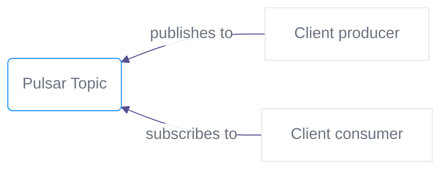

[Pulsar](https://pulsar.apache.org/) works on a publisher/subscriber model. It allows services to communicate asynchronously, with latencies ranging around 100 milliseconds. It is used for streaming analytics and data integration pipelines to ingest and distribute data. It's equally effective as messaging-oriented middleware for service integration or as a queue to parallelize tasks. It also enables you to create systems of event producers and consumers. Publishers communicate with subscribers asynchronously by broadcasting events.



There are several modes of subscription. A consumer may subscribe exclusively, or share the subscription with other consumers. Here are the four subscription types:

- Exclusive (only one consumer for the subscription)
- Failover (if a consumer fails, another one receives the message)
- Shared (messages are distributed to several consumers)
- Key_Shared (messages come with keys and go to consumers with the corresponding key)

More on this in the [official documentation](https://pulsar.apache.org/docs/en/concepts-messaging/#subscriptions).

A topic is defined this way:

`{persistent|non-persistent}://tenant/namespace/topic`

Tenants and namespaces allow for grouping and sub-grouping of topics.

A Clever Cloud Pulsar add-on is basically an immutable `tenant/namespace` where the tenant is your organisation ID, and the namespace is the add-on ID.
It allows you to create and use topics following this pattern:

`{persistent|non-persistent}://<CLEVERCLOUD_TENANT_ID>/<ADDON_ID>/<TOPIC_NAME>`

## Version

We maintain up-to-date Pulsar clusters based on the official Apache Pulsar release process. Your Pulsar add-on version is available in your add-on dashboard.

## Common use cases

- **Replicating data among databases** using [Pulsar IO](https://pulsar.apache.org/docs/en/io-overview/) is commonly used to distribute change events from databases.
- **Parallel processing and workflows**. You can efficiently distribute a large number of tasks among multiple workers (compressing text files, sending email notifications).
- **Data streaming from IoT devices**. For example, a residential sensor can stream data to backend servers.
- **Refreshing distributed caches**. For example, an application can publish invalidation events to update the IDs of objects that have changed.
- **Real-time event distribution**. Events, raw or processed, may be made available to multiple applications across your team and organisation for real time processing.

## Create a Pulsar add-on

It is as simple and straightforward as creating any other add-on. In your personal space, click on *Create* > *an add-on* > *Pulsar*. Choose your plan, link an app to it (or not), give it a name and a zone, and it's done.

See [Examples](/doc/deploy/pulsar/examples) for client snippets in Rust, Java and Python, and for managing namespaces, topics and their policies.

## Storage

### Retention

A Pulsar add-on is provided with infinite retention policies, which can be changed using:

```bash
# Example to set retention of namespace to 2 weeks and/or 100 GB
pulsarctl --admin-service-url $ADDON_PULSAR_HTTP_URL \
          --auth-params $ADDON_PULSAR_TOKEN \
          --auth-plugin org.apache.pulsar.client.impl.auth.AuthenticationToken \
          namespaces set-retention $ADDON_PULSAR_TENANT/$ADDON_PULSAR_NAMESPACE --time 2w --size 100G
```

### Offload storage to Cellar (S3)

Pulsar has a [tiered storage feature](https://pulsar.apache.org/docs/en/tiered-storage-overview/) allowing to offload heavy data to cold storage once a threshold is reached.

For each Pulsar add-on we provide, we also provide a hidden [Cellar add-on](/doc/deploy/storage/cellar), our object storage add-on. This Cellar add-on is bound to the Pulsar namespace offload policies and will store your offloaded data.

The offload threshold of the namespace is deactivated by default, you can activate it with:

```bash
# Example to set offload to run when hot storage is > 10G and put data to Cellar Addon
pulsarctl --admin-service-url $ADDON_PULSAR_HTTP_URL \
          --auth-params $ADDON_PULSAR_TOKEN \
          --auth-plugin org.apache.pulsar.client.impl.auth.AuthenticationToken \
          namespaces set-offload-treshold $ADDON_PULSAR_TENANT/$ADDON_PULSAR_NAMESPACE 10G
```
