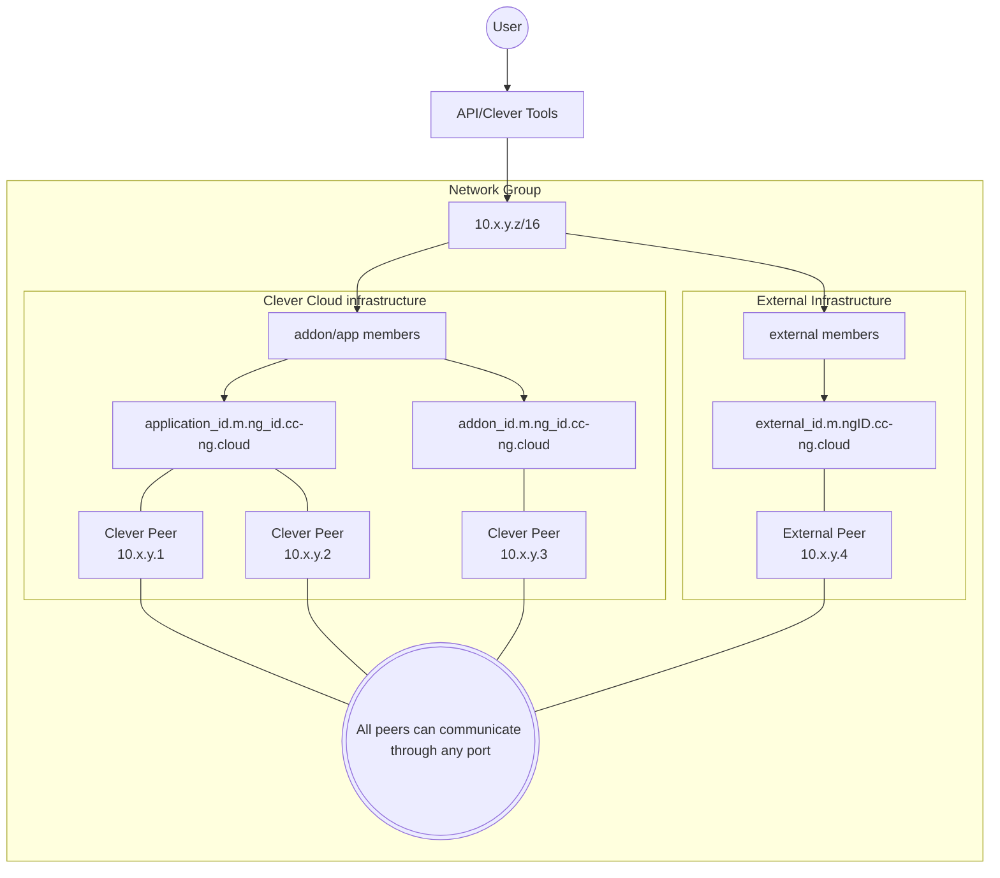

Network Groups (NG) are a way to create a private secure network between resources inside Clever Cloud infrastructure, using [WireGuard](https://www.wireguard.com/). It's also possible to connect external resources to a Network Group. There are three components to this feature:

* Network Group: a group of resources that can communicate with each through an encrypted tunnel
* Member: a resource that can be part of a Network Group (`application`, `addon` or `external`)
* Peer: Instance of a resource connected to a Network Group (can be `external`)

A Network Group is defined by an ID (`ngId`) and a `label`. It can be completed by a `description` and `tags`.

When you create a Network Group, a WireGuard configuration is generated with a corresponding [CIDR](https://en.wikipedia.org/wiki/Classless_Inter-Domain_Routing). Then, you can, for example, link an application and an add-on to the same Network Group. These are members, defined by an `id`, a `label`, a `kind` and a `domain name`.


During beta testing phase, you can add add-ons and external peers to a Network Group, but these features are not yet fully supported. \
A Network Group member domain name is composed this way: `<memberID>.m.<ngID>cc-ng.cloud`


When a resource is linked to a Network Group, you can reach it on any port inside this private network with its domain name. An application instance is a peer, you can reach through an IP (from the attributed CIDR). It works the same way for add-ons and external resources.

- [Network Groups demo application](https://github.com/CleverCloud/network-groups-example)
- [How to use Network Groups from Clever Tools](/developers/doc/cli/network-groups/)
- [Keycloak and Otoroshi native support for Network Groups](/developers/api/v4/#network-groups)
- [Tell us what you think of Network Groups and what features you need from it in](https://github.com/CleverCloud/Community/discussions/categories/network-groups).

## Architecture

## Concepts

### Network Group
Network Groups operate as an overlay network, on top of the existing physical network infrastructure (underlay). When two peers communicate within a Network Group, packets are encapsulated in WireGuard tunnels that traverse Clever Cloud's underlay network.

This approach enables the creation of flexible virtual network topologies without modifying the underlying physical infrastructure. Thanks to this overlay architecture, you can establish private and secure communications between your resources, even if they are physically dispersed across different zones of Clever Cloud's infrastructure or outside of it.

Each Network Group has a unique ID (ngId), a human-readable label, and can include an optional description and tags for organisation.

### Members
Resources connected to a Network Group can be applications or add-ons running on Clever Cloud (databases, services, etc.), or external resources outside of Clever Cloud (a third-party server, your local machine). Each member is accessible via a domain name.

### Peers
Individual instances of a member resource. For example, if your application scales to three instances, each instance becomes a peer in the Network Group with its own IP address from the assigned CIDR range.

## Key Benefits
Network Groups offer secure communication with all traffic between resources encrypted using WireGuard. You gain DNS resolution to access resources by domain name within the Network Group, along with internal port access to reach any port on any resource inside the Network Group. This creates a simplified architecture where you can connect applications and their dependencies in a private network.

## Use Cases
Network Groups excel in microservices architecture by connecting multiple services securely without exposing them to the public internet. They simplify database access by allowing applications to access database add-ons through a secure channel. For legacy integration, they help connect external systems securely to your cloud applications. They also provide isolated environments for development and testing.

## Technical Implementation
Network Groups leverage WireGuard, a modern VPN protocol known for its simplicity, speed, and security. When you create a Network Group, a dedicated CIDR range is allocated for your Network Group and WireGuard configurations are generated. When members join, they're assigned DNS names and IPs from the CIDR range, encrypted tunnels are established between peers, and traffic between resources flows through these secure tunnels.

## Best Practices
Create Network Groups based on functional requirements or environments such as production or staging. Use clear, consistent naming for Network Groups and tag them appropriately. Establish different Network Groups to separate security domains, and keep track of which resources belong to which Network Groups.
