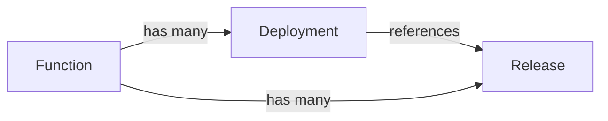
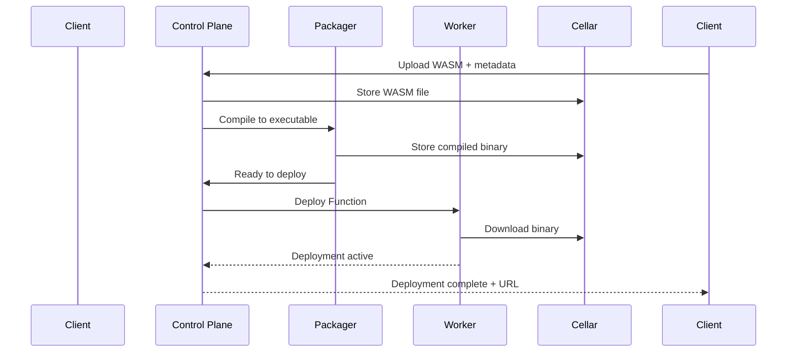
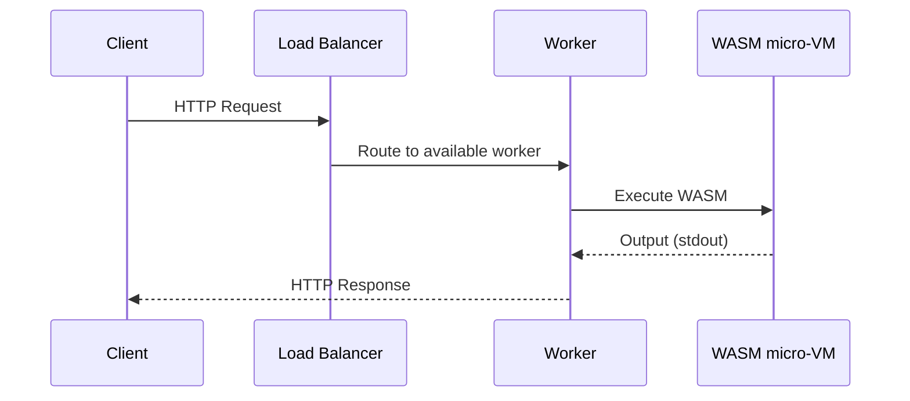

Clever Functions execute in response to events (HTTP calls, Pulsar messages) without cold boot, in nanoseconds, while scaling automatically. Functions run in extra-light virtual machines using WebAssembly, providing strong isolation without containers. You can write Clever Functions in any language that compiles to WebAssembly (WASM/WASI), such as AssemblyScript, C, C++, Go, JavaScript, Rust or Zig.

> [!NOTE] Clever Functions is in private access
> Ask for activation to your sales representative or [Clever Cloud support](https://console.clever-cloud.com/ticket-center-choice)

## Key Features

- Automatic scaling
- WASI-compatible WASM runtime
- Strong isolation without containers
- Server-side compilation for supported languages
- Event-driven execution via HTTP or Pulsar triggers

## Server-side compilation

For many languages, you don't have to compile your code to WASM yourself; just upload your source code and Clever Cloud's platform takes care of the rest. Supported languages and toolchains are:

| Language       | Toolchain            | Platform code    | Aliases      |
| -------------- | -------------------- | ---------------- | ------------ |
| Rust           | rustc                | `rust`           | —            |
| Go             | TinyGo               | `go`             | `tinygo`     |
| AssemblyScript | asc                  | `assemblyscript` | `asc`        |
| JavaScript     | QuickJS (customized) | `js`             | `javascript` |

## Architecture

Functions use three core resources:

| Resource       | Description                                                                   | Lifecycle                       |
| -------------- | ----------------------------------------------------------------------------- | ------------------------------- |
| **Function**   | Configuration container (environment variables, memory limits, max instances) | Created once, updated as needed |
| **Release**    | A version of your WASM code stored in the registry                            | Created on each code upload     |
| **Deployment** | An active instance running a specific release                                 | Created to make a release live  |

A Function can have multiple releases (code versions) and multiple deployments. Each deployment references exactly one release.



### Deployment lifecycle

When you deploy a Function, a client sends your WASM file to the control plane API, the registry stores the WASM and returns a release ID, the packager compiles WASM into an optimized executable binary, the scheduler selects the best worker based on current load, a worker downloads the binary and starts serving requests. Then, the Function is accessible via its HTTP endpoint:



### Workflow

When you invoke a Function via HTTP, a request arrives at Clever Cloud's load balancer (Sōzu), is  routed to an available worker based on Function configuration, then a  worker executes your WASM binary in an isolated micro-VM. Finally, the response is returned to caller:



## Prerequisites

To use Clever Functions you'll need :
- An authorized access for your organisation
- Clever Tools with Functions commands

To check if you have access to Clever Functions for your organisation, run the following command in your terminal:

```bash
clever features enable functions
clever kms --org <your_org_id>
```

## Create a Function

Create a new Function in your organization using `cleverctl`:

```bash
clever functions create --org <your_org_id>
```

The response contains the `function_id` you'll use for all subsequent operations:

```json
{
  "id": "function_id",
  "ownerId": "your_org_id",
  "environment": {},
  "maxMemory": 67108864,
  "maxInstances": 1,
  "createdAt": "2023-06-24T21:29:25.898985Z",
  "updatedAt": "2023-06-24T21:29:25.898985Z"
}
```

### Set Environment Variables

Pass environment variables to your Function at runtime:

```bash
clever functions set-env 'FOO=BAR,HELLO=WORLD' <function_id> --org <your_org_id>
```

## Deploy a Function

To deploy a Function using server-side compilation or pre-compiled WASM, use the `deploy` command:

```bash
clever functions deploy <source_file> <function_id> --org <your_org_id>
clever functions deploy <wasm_file> <platform_code> <function_id> --org <your_org_id>
```

During deployment, the platform handles multiple steps to ensure your Function is live and ready to serve requests:
1. Uploads your code and creates a release
2. Triggers server-side compilation if needed
3. Creates a deployment referencing the release
4. Schedules the deployment to available workers

Once deployed, call your deployed Function via its HTTP endpoint:

```bash
curl https://functions-technical-preview.services.clever-cloud.com/<function_id>
```

Functions receive data from `stdin` and send data through `stdout`. In debug mode, `stderr` and `dmesg` are also available.

## Manage a Function and its deployments

```bash
# List all deployments for a Function to check their status:
clever functions deploy list <function_id> --org <your_org_id>

# Remove a specific deployment while keeping the Function:
cleverctl functions deploy delete <function_id> <deployment_id> --org <your_org_id>

# Delete the Function entirely along with all its deployments:
cleverctl functions delete <function_id> --org <your_org_id>
```

## Triggers

Triggers define how Functions receives structured input and returns structured output. During private access phase, HTTP and Pulsar triggers are supported through JavaScript and Rust integrations. Future versions will adopt the WASM Component Model for broader compatibility.

The HTTP trigger gives your Function access to the full HTTP request (body, headers, method) and lets it return a structured HTTP response. Append `?trigger=http` to the endpoint:

```
https://functions-technical-preview.services.clever-cloud.com/<function_id>?trigger=http
```

Here is a minimal example that returns the caller's User-Agent:

```js
function trigger_http(request) {
  return {
    status: 200,
    statusText: "OK",
    headers: {
      "Content-Type": "text/plain",
      "X-Powered-By": "CleverCloud",
    },
    body: `User-Agent: ${request.headers["User-Agent"]}`,
  };
}
```

## TCP Connections

In private access phase, we support WASI 1.0 which can handle TCP connection but lacks socket opening Functions. Clever Functions will implement WASI 2.0 for full TCP support, but in the meantime, you can use host Functions we provide to fill this gap:

```c
void host_tcp_connect(char* address_ptr, size_t address_size, unsigned int flags, void* fd_ptr);

// With TLS support
void host_tls_connect(char* address_ptr, size_t address_size, char* hostname_ptr, size_t hostname_size, unsigned int flags, void* fd_ptr);
```

In JavaScript, the QuickJS toolchain gives you access to a higher-level API:

```js
let socket = await net.WasiTcpConn.connect(address);
```

## Troubleshooting

Get detailed execution information by appending `?debug` to your Function URL:

```bash
curl "https://functions-technical-preview.services.clever-cloud.com/<function_id>?debug"
```

Output:

```json
{
  "stdout": "Hello Rust!\n",
  "stderr": "",
  "dmesg": "Start time: 2.202681ms\n\nWASI_FD_WRITE(vmctx=30c0ffee, 01, ffec8, 01, ffe9c)\n\tnwritten: 12\nHOST_HALT(vmctx=c000, 00)\n\tGRACEFULLY EXIT\n\nHalt reason: host_halt\n\n\tat 0x00001003: internal::graceful_exit\n\t\tmangled state: no valid stackframe found (rsp:00200010, rbp:00200008)\n\nRun time: 3.359928ms\nTotal time: 5.65287ms\n",
  "trigger": "Std",
  "responseBody": "",
  "currentPages": 17,
  "size": 2310144
}
```

**Debug fields:**

| Field          | Description                                                                    |
| -------------- | ------------------------------------------------------------------------------ |
| `stdout`       | Standard output from the Function                                              |
| `stderr`       | Error output from the Function                                                 |
| `dmesg`        | Debug messages including timing and WASI hostcall traces (similar to `strace`) |
| `trigger`      | Trigger type that executed the Function                                        |
| `responseBody` | HTTP response body (HTTP trigger only)                                         |
| `currentPages` | Memory pages used (4096 bytes each)                                            |
| `size`         | WASM binary size in bytes                                                      |

**Timing in `dmesg`:** `Start time` (init), `Run time` (execution), `Total time` (elapsed).
