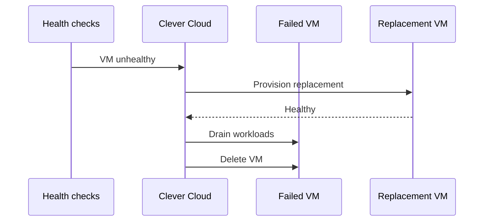
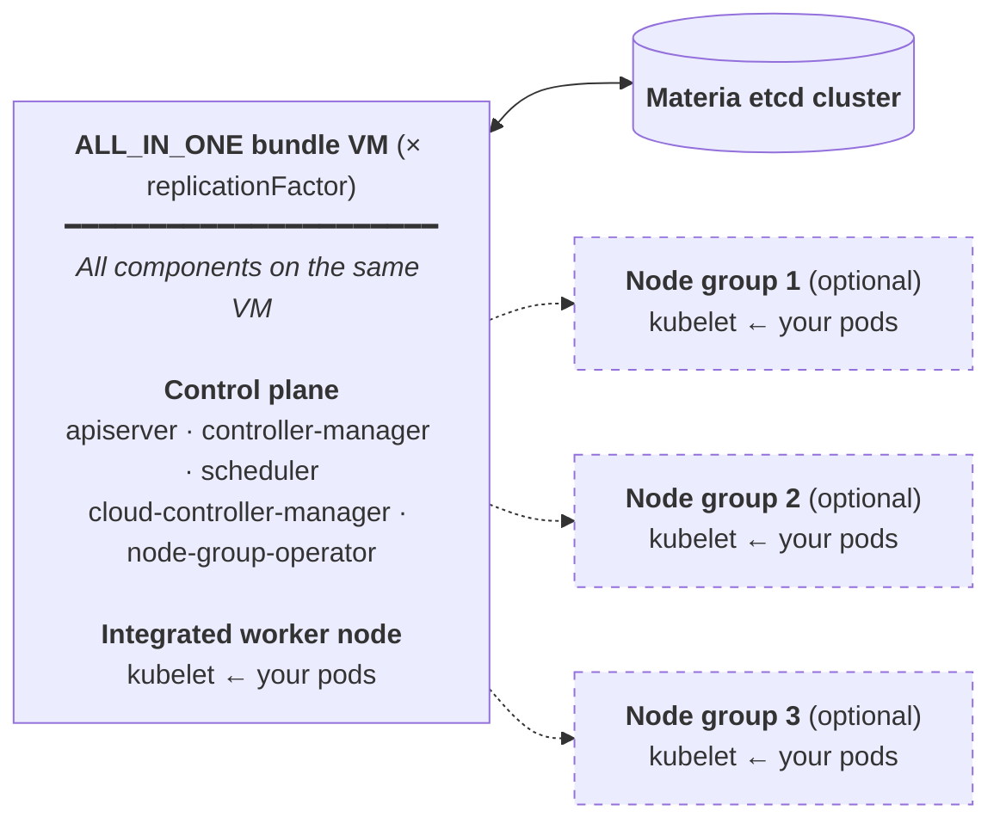
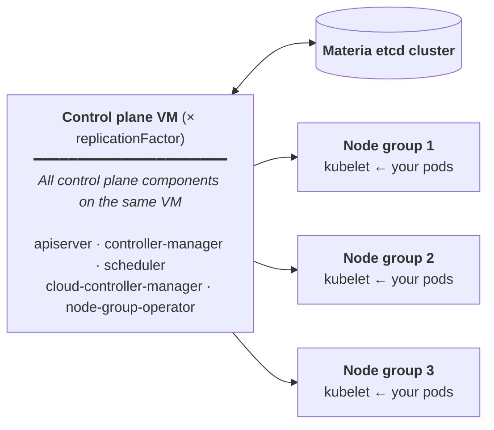
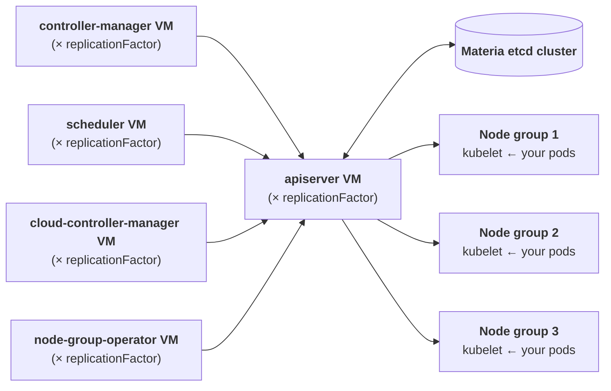

Clever Kubernetes Engine (CKE) allows you to create and manage Kubernetes clusters with ease on Clever Cloud infrastructure. It uses Materia etcd, our implementation of etcd built on top of FoundationDB, as the backing store for your cluster's state. It ensures reliability at scale.

Our approach remains the same as with our other products: our Kubernetes offer is based on open-source technologies, we create value and enhance your developer/user experience through some parts of the stack created and maintained by our engineering team, but we provide a "vanilla" Kubernetes experience to our customers, with no lock-in. It's easy to migrate your workloads to and from Clever Kubernetes.

We operate the Kubernetes control plane for you: upgrades, availability, and patching are our responsibility. You manage your own node pools — scaling them up or down manually as needed — while we ensure the control plane remains stable. Access is straightforward: we provide a kubeconfig file so you can use `kubectl` or any other Kubernetes compatible tool with the same workflow you already know.

> [!NOTE] Clever Kubernetes is in public beta
> Activate it from your [Console Labs](https://console.clever-cloud.com/users/me/feature-list) or via the Clever Tools feature flag (`clever features enable k8s`). To raise your default quota or request test credits, contact your sales representative or [Clever Cloud support](https://console.clever-cloud.com/ticket-center-choice).

## Why Clever Kubernetes Engine

### Fully managed control plane on sovereign French infrastructure

Patching, Kubernetes upgrades, certificate rotation and control plane availability are handled by Clever Cloud, on sovereign infrastructure operated end-to-end by our team in France — no foreign hyperscaler in the loop. Every control plane component and every worker runs on a **dedicated VM** — nothing is shared between clusters or between tenants. Your responsibility stops at the workloads and the node groups that host them — the control plane is just there, healthy. Clusters come with vanilla Kubernetes: you keep the classic `kubectl` workflow and you can leave the platform without rewriting a single manifest.

### Native auto-healing

When a control plane VM or a worker fails its health checks, the platform provisions a replacement, waits for it to become healthy, then removes the failed VM. The mechanism works with any replication factor — including `rf = 1`. No manual intervention, no `kubectl drain` to script.



### On-demand autoscaling

The cluster autoscaler is opt-in, per node group. Leave it disabled for stable workloads and predictable billing, or enable it when your workloads need elasticity (`--autoscaling --min N --max N`). The autoscaler reacts to node-level resource pressure (CPU and memory load on the worker VMs) and resizes the node group within the bounds you define, up or down. See [Manage node groups](#manage-node-groups) for commands.

### 3 datacenters in Paris and dedicated load balancer IPs

The platform is distributed across 3 datacenters in Paris, with multi-site replication built in. Pick a control plane replication factor of `3` or more in `DEDICATED_COMPUTE` or `DISTRIBUTED`, and the VMs are spread across the three sites — a single datacenter loss does not take your control plane down. Each `LoadBalancer` Service provisions an L4 load balancer (TCP and UDP) with its own dedicated configuration and **two public IP addresses reserved for your service**. The underlying load balancer fleet is shared across customers, but every Service gets its own logical entry point and its own IPs.

### Cilium and eBPF networking

The CNI is Cilium, running on top of eBPF. You get fast pod-to-pod networking, native NetworkPolicies, observability hooks and the ability to plug in extra Cilium features (Hubble, mTLS, etc.) without swapping the underlying CNI. When a cluster spans multiple VMs, the underlying inter-VM transport is a [Network Group](/doc/develop/network-groups/) — a private WireGuard-based mesh that connects the control plane and worker VMs.

### Materia etcd, made in France on FoundationDB

The cluster state store is Materia etcd, our **serverless** implementation of the etcd API built on top of FoundationDB. Designed and developed in France by Clever Cloud engineers, Materia etcd brings FoundationDB's track record at scale to thousands of clusters without the operational burden of running, sizing or backing up etcd yourself — no etcd VM to provision, no quorum to manage.

### Simple deployment and version management

Create a cluster in one command, follow its rollout with `--watch`, upgrade Kubernetes with `clever k8s version update`, audit deployment events with `clever k8s activity`. The full cluster and node group lifecycle is exposed in the API and in [Clever Tools 4.9+](/doc/cli/kubernetes/) (Console support coming soon). Persistent storage is available as an opt-in through a CSI driver backed by Ceph; pods consume it via standard `PersistentVolumeClaim` resources.

A control plane replication factor greater than `1` smooths upgrades and incident windows: VMs are rotated one at a time, so the apiserver stays reachable while the platform replaces the others. The same applies to multi-node node groups during rolling upgrades — your workloads keep running on the remaining nodes while one is being replaced.

### Integrated with the Clever Cloud platform

Provision PostgreSQL, Pulsar, Materia KV or any other Clever Cloud add-on directly from inside your cluster via the [Clever Kubernetes Operator](#clever-kubernetes-operator) — managed services declared as custom resources, reconciled alongside your workloads.

## Cluster topologies

A Kubernetes cluster on Clever Cloud is made of a control plane and one or more node groups. The control plane runs the Kubernetes components (`apiserver`, `controller-manager` and `scheduler`) and the Clever Cloud operators (`cloud-controller-manager` and `node-group-operator`). Node groups are pools of worker virtual machines where your workloads are scheduled by the Kubernetes `kubelet` component.

You choose how the control plane is distributed at creation time. The topology decides the placement of the Kubernetes components, the available flavors, whether workloads share the same VMs as the control plane, and ultimately what gets billed. Three layouts are available:

|Topology|Customers|VMs you pay for|Flavors|Default node group included?|Typical use case|
|---|---|---|---|---|---|
|`ALL_IN_ONE`|Developers|`replicationFactor` × bundle VM (control plane + integrated worker node). Additional node groups billed separately|`S`, `M`, `L`, `XL`|No node group, but each bundle VM is also a worker node — additional node groups optional|Development, testing, small single-team clusters|
|`DEDICATED_COMPUTE`|Business|`replicationFactor` × control plane VM **plus** every worker VM in your node groups|`XS`, `S`, `M`, `L`, `XL`|No — provision a node group at creation with `--nodegroup` or later|Production clusters where control plane and workloads stay isolated|
|`DISTRIBUTED`|Enterprise|For each of 5 components: `replicationFactor` × component VM **plus** every worker VM in your node groups|`2XS`, `XS`, `S`, `M`, `L`, `XL`|No — provision a node group at creation or later|Demanding production clusters needing fine-grained HA per control plane component|

`ALL_IN_ONE` is the default when no topology is specified at cluster creation through Clever Tools or the Console. A replication factor (`1` to `5`) applies to the control plane VMs: the higher the factor, the more resilient the control plane and, in `DEDICATED_COMPUTE` or `DISTRIBUTED`, the more sites it is spread across (up to three Parisian datacenters). In `DISTRIBUTED`, each of the five components has its own flavor and its own replication factor, letting you scale a busy `apiserver` higher than a quieter `scheduler`.

In `ALL_IN_ONE`, every VM in the bundle is also a worker node — the bundle covers it at no extra cost. You can still attach node groups to an `ALL_IN_ONE` cluster, and those are billed at the node group rate. In `DEDICATED_COMPUTE` and `DISTRIBUTED`, the control plane VMs are dedicated to control plane workloads and your pods land on **separate worker VMs** that you provision in node groups, billed at the node group rate. See [Pricing](#pricing) for the breakdown.

Whenever a cluster spans multiple VMs — additional node groups on `ALL_IN_ONE`, the control plane and workers in `DEDICATED_COMPUTE`, the five components and workers in `DISTRIBUTED` — the VMs talk to each other over a [Network Group](/doc/develop/network-groups/), a private WireGuard-based mesh provisioned automatically with the cluster. Inter-component traffic stays on the private network.

**Developers (`ALL_IN_ONE`)** — one VM hosts the five control plane components plus an integrated worker node, replicated `replicationFactor` times. Additional node groups (optional) can be attached to scale compute beyond the bundle and are billed at the [node group rate](#node-groups-workers).



**Business (`DEDICATED_COMPUTE`)** — one VM dedicated to the bundled control plane, separate worker VMs in node groups.



**Enterprise (`DISTRIBUTED`)** — one VM per control plane component (each with its own flavor and replication factor), separate worker VMs in node groups.



Topology and replication factor are immutable after creation. Flavor is bound to the topology — changing it means recreating the cluster.

## Prerequisites

Clever Kubernetes is activated per user. Enable it either from your [Console Labs](https://console.clever-cloud.com/users/me/feature-list) or with the Clever Tools feature flag:

```bash
clever features enable k8s
```

You also need:

- [Clever Tools](/doc/cli/) 4.9 or later installed (recommended for the full Kubernetes command set)
- `kubectl` installed ([installation guide](https://kubernetes.io/docs/tasks/tools/#kubectl))

Verify your setup by listing the clusters of your organisation:

```bash
clever k8s list --org <your_org_id>
```

- [Learn more about Clever Tools k8s command](/doc/cli/kubernetes/)

## Create a Kubernetes cluster

The fastest way to create a cluster is to provide only a name. The platform picks `ALL_IN_ONE` as the default topology, the minimum flavor available for it (`S`) and a replication factor of `1`:

```bash
clever k8s create clusterName --org <your_org_id>
```

The cluster is created immediately and starts its deployment. It takes approximately one minute to provision the underlying infrastructure. To follow progress until the cluster reaches the `ACTIVE` state, add `--watch`:

```bash
clever k8s create clusterName --org <your_org_id> --watch
```

When you need a specific shape, combine topology, flavor and replication factor:

```bash
clever k8s create myCluster \
  --topology DEDICATED_COMPUTE --flavor S --replication-factor 3 \
  --cluster-version 1.36 \
  --description "Production cluster" \
  --tag env:prod,team:platform \
  --autoscaling \
  --persistent-storage \
  --nodegroup M:3
```

The `--nodegroup <flavor>:<count>` option provisions an initial node group named `default` at creation time, so the cluster is ready to schedule workloads as soon as it reaches `ACTIVE`. It is the typical pattern for `DEDICATED_COMPUTE` and `DISTRIBUTED`. `ALL_IN_ONE` clusters already include an integrated worker node on each bundle VM; if you still pass `--nodegroup` on an `ALL_IN_ONE` cluster, Clever Tools warns you and prompts for confirmation before adding the extra pool.

List your clusters at any time:

```bash
clever k8s list --org <your_org_id>
```

> [!TIP]
> In [Clever Cloud Console](https://console.clever-cloud.com), you can filter Kubernetes clusters in the left menu by searching for `is:k8s`, `is:kube` or `is:kubernetes`.

## Supported versions

Clever Cloud follows [the official Kubernetes version support policy](https://kubernetes.io/releases/), which maintains support for the most recent three minor versions (n-2). At any given time, the Kubernetes project maintains release branches for the latest three minor releases.

The current Kubernetes release on the platform is **v**, available with `--cluster-version ` at creation. New clusters default to **v** when no version is specified. Supported versions are , unsupported versions are .

Each Kubernetes minor version receives patch releases (security fixes, bug fixes) during a support window of approximately 12 months that starts at its initial release. After that window, the version is deprecated and stops receiving patches. It's a good practice to maintain your clusters on a supported version to benefit from the latest security patches, bug fixes, and features. For clusters running unsupported versions, Clever Cloud reserves the right to initiate automatic upgrades to ensure platform security and stability.

## Manage node groups

A node group is a pool of virtual machines of the same flavor (vCPU, RAM, location) that serves as the compute resources for your cluster. Node groups simplify scaling by letting you manage similar nodes together as a unit rather than one machine at a time. A cluster can host several node groups with different flavors, which is how you mix general-purpose workloads with larger workers for dedicated jobs.

You can manage node groups either with Clever Tools or directly from Kubernetes using the `NodeGroup` custom resource. Both paths talk to the same Clever Cloud API and produce identical results.

### With Clever Tools

Create a node group, then list or inspect them:

```bash
clever k8s nodegroups create myCluster workers M:3
clever k8s nodegroups list myCluster
clever k8s nodegroups get myCluster workers
```

To scale, toggle autoscaling, or change metadata, use `update`:

```bash
clever k8s nodegroups update myCluster workers --count 5
clever k8s nodegroups update myCluster workers --autoscaling --min 2 --max 10
clever k8s nodegroups update myCluster workers --disable-autoscaling
clever k8s nodegroups update myCluster workers --description "GPU-intensive workers"
```

Deleting a node group drains its nodes and removes the underlying VMs:

```bash
clever k8s nodegroups delete myCluster workers
```

### With kubectl

Define a `NodeGroup` resource in a YAML file and apply it:

```yaml{filename="example-nodegroup.yaml"}
apiVersion: api.clever-cloud.com/v1
kind: NodeGroup
metadata:
  name: example-nodegroup
spec:
  flavor: M
  nodeCount: 2
```

```bash
kubectl create -f example-nodegroup.yaml
```

The node group creation process takes approximately 60 to 90 seconds to complete. Once ready, the new nodes automatically join the cluster and become available for scheduling. Inspect them with the standard Kubernetes verbs:

```bash
kubectl get nodegroups

NAME                DESIREDNODECOUNT   CURRENTNODECOUNT   FLAVOR   STATUS   AGE
example-nodegroup   2                  2                  M        Synced   2m

kubectl get nodes

NAME                      STATUS   ROLES    AGE     VERSION
example-nodegroup-node0   Ready    <none>   6d17h   v1.35.4
example-nodegroup-node1   Ready    <none>   3d18h   v1.35.4
```

`DESIREDNODECOUNT` is the number of nodes you asked for, `CURRENTNODECOUNT` is the number of nodes currently in the node group. When creating a node group, `CURRENTNODECOUNT` starts at `0` and increases until it reaches `DESIREDNODECOUNT`.

To scale with `kubectl`, use the standard `scale` verb:

```bash
kubectl scale nodegroup example-nodegroup --replicas=4
```

### Autoscaling on demand

The cluster autoscaler is not active by default. Enable it once at cluster level (at creation with `--autoscaling`, later with `clever k8s update <cluster> --autoscaling`), then set the bounds per node group:

```bash
clever k8s nodegroups update myCluster workers --autoscaling --min 2 --max 10
```

Once enabled, the autoscaler reacts to node-level resource pressure (CPU and memory load on the worker VMs) and resizes the node group within the `--min` and `--max` bounds you defined. Switch it off with `--disable-autoscaling` on the node group when you want a fixed-size pool, or at cluster level to stop the autoscaler altogether.

## Add persistent storage (CSI)

You can use Clever Cloud block storage to attach a persistent volume to a cluster through a CSI (Container Storage Interface). Enable persistent storage at creation with `--persistent-storage`, or on an existing cluster:

```bash
clever k8s update clusterNameOrId --persistent-storage --org <your_org_id>
clever k8s add-persistent-storage clusterNameOrId --org <your_org_id>
```

Both commands reach the same result. Persistent storage is currently a one-way toggle: once enabled, it cannot be removed from a running cluster. Create a new cluster without `--persistent-storage` if you no longer need it.

## Get the kubeconfig file

Get the kubeconfig file to interact with your cluster:

```bash
clever k8s get-kubeconfig clusterNameOrId --org <your_org_id>
```

You can directly save it as your local kubeconfig file:

```bash
clever k8s get-kubeconfig clusterNameOrId --org <your_org_id> > ~/.kube/config
```

Check everything is working by listing the nodes of your cluster (it should be empty at this point):

```bash
# With the default kubeconfig file:
kubectl get nodes

# To target a specific kubeconfig file:
kubectl get nodes --kubeconfig=kubeconfig.yaml
```

## Pull images from authenticated registries

Public registries like Docker Hub rate-limit anonymous pulls, which can fail deployments when many pods come up at the same time. Authenticate your pulls by declaring your registry credentials inside the cluster as a standard `imagePullSecrets` and referencing it from your workloads.

Create a secret of type `kubernetes.io/dockerconfigjson` with `kubectl`:

```bash
kubectl create secret docker-registry dockerhub-creds \
  --docker-server=https://index.docker.io/v1/ \
  --docker-username=<username> \
  --docker-password=<password_or_token> \
  --docker-email=<email>
```

Reference the secret from your Pod spec via `imagePullSecrets`:

```yaml{filename="deployment-private.yaml"}
apiVersion: apps/v1
kind: Deployment
metadata:
  name: my-app
spec:
  replicas: 2
  selector:
    matchLabels:
      app: my-app
  template:
    metadata:
      labels:
        app: my-app
    spec:
      imagePullSecrets:
        - name: dockerhub-creds
      containers:
        - name: my-app
          image: myorg/my-private-image:1.0
```

To avoid repeating `imagePullSecrets` in every Pod, patch the default `ServiceAccount` of your namespace so all Pods inherit the credentials:

```bash
kubectl patch serviceaccount default \
  -p '{"imagePullSecrets":[{"name":"dockerhub-creds"}]}'
```

The same pattern applies to any OCI-compliant registry (GitHub Container Registry, GitLab Registry, AWS ECR, Google Artifact Registry, self-hosted Harbor, etc.) — adjust `--docker-server`, `--docker-username` and `--docker-password` accordingly. For registries that issue short-lived tokens (ECR, GAR), rotate the secret with a CronJob or an external controller.

## Deployment with a load balancer service

Before deploying workloads, the cluster needs worker nodes. An `ALL_IN_ONE` cluster ships with an integrated worker node on each bundle VM, so the cluster is ready to schedule pods as soon as it reaches `ACTIVE`. With `DEDICATED_COMPUTE` or `DISTRIBUTED`, provision a node group first — either at cluster creation with `--nodegroup <flavor>:<count>` (see [Create a Kubernetes cluster](#create-a-kubernetes-cluster)) or afterwards with `clever k8s nodegroups create` (see [Manage node groups](#manage-node-groups)).

Once workers are available, here is an example of a simple NGINX deployment with a load balancer service:

```bash
kubectl create deployment nginx --image=nginx:alpine --replicas=2
kubectl expose deployment/nginx --type=LoadBalancer --port 80
```

Alternatively, you can create a YAML file named `deployment-demo.yaml` with the following content and apply it using `kubectl apply -f deployment-demo.yaml`:

```yaml{filename="deployment-demo.yaml"}
apiVersion: apps/v1
kind: Deployment
metadata:
  name: nginx-deployment
spec:
  selector:
    matchLabels:
      app: nginx
  replicas: 2 # tells deployment to run 2 pods matching the template
  template:
    metadata:
      labels:
        app: nginx
    spec:
      containers:
        - name: nginx
          image: nginx:1.30.0
          ports:
            - containerPort: 80
---
apiVersion: v1
kind: Service
metadata:
  name: nginx-service
  labels:
    app: nginx
spec:
  type: LoadBalancer
  selector:
    app: nginx
  ports:
    - protocol: TCP
      port: 80        # Port accessible from outside the cluster
      targetPort: 80  # Port on which the container is listening
```

## Quotas and limits

Each organisation starts with **40 vCPU and 40 GB of RAM** across all its Kubernetes clusters by default. This envelope covers both the control plane VMs and the worker nodes, whatever their topology. Check your current consumption and the remaining budget at any time with `clever k8s quota`. If you need more, contact your sales representative or [Clever Cloud support](https://console.clever-cloud.com/ticket-center-choice).

Each organisation also comes with **two public IP addresses**, which corresponds to a single `LoadBalancer` service across all its clusters. Additional `LoadBalancer` services are accepted by the Kubernetes API but stay in a pending state until the quota is lifted — `kubectl describe svc` typically reports error 507 in that case.

## Pricing

> [!NOTE] Pricing during the public beta
> Only the control plane and compute nodes are billed for now. Persistent storage (CSI) and load balancers will be added to your invoice before the platform reaches general availability. Customers will be notified ahead of the change — follow the [changelog](/changelog/) to stay informed.

Prices are **excluding taxes**. The platform charges by the hour, per resource (vCPU and RAM): the per-VM rate below is `vCPU × vCPU_rate + RAM_GB × RAM_rate`. Monthly prices are computed using the standard 720-hours-per-month convention (30 × 24).

The model is: **one price per topology**, charged per control plane element per replication, **plus** the [node group rate](#node-groups-workers) for every worker VM you provision in additional node groups. `ALL_IN_ONE` is special: its bundle price already covers the five control plane components **and** an integrated worker node on each bundle VM. If you attach additional node groups to an `ALL_IN_ONE` cluster, those extra workers are billed at the node group rate.

In practice:

- **`ALL_IN_ONE`** — `replicationFactor` × the bundle VM price (covers the five control plane components and the integrated worker node). Additional node groups, if any, are billed at the [node group rate](#node-groups-workers).
- **`DEDICATED_COMPUTE`** — `replicationFactor` × the control plane VM price, **plus** the [node group rate](#node-groups-workers) for every worker VM in your node groups.
- **`DISTRIBUTED`** — for each of the five components, `replicationFactor` × the component VM price (each component picks its own flavor and replication factor), **plus** the [node group rate](#node-groups-workers) for every worker VM in your node groups.

### Developers (`ALL_IN_ONE`) bundle

The bundle hosts the five control plane components and an integrated worker node on the same VMs. The price below covers everything; additional node groups attached to an `ALL_IN_ONE` cluster are billed separately at the [node group rate](#node-groups-workers).

|Flavor|Resources|Hourly price|Monthly price|
|---|---|---|---|
|S|8 vCPU / 12 GB|0.0889 €|64.00 €|
|M|10 vCPU / 16 GB|0.1167 €|84.00 €|
|L|12 vCPU / 24 GB|0.1667 €|120.00 €|
|XL|16 vCPU / 32 GB|0.2222 €|160.00 €|

### Business (`DEDICATED_COMPUTE`) control plane

One VM per replication factor, dedicated to the control plane.

|Flavor|Resources|Hourly price|Monthly price|
|---|---|---|---|
|XS|6 vCPU / 8 GB|0.0917 €|66.00 €|
|S|8 vCPU / 12 GB|0.1333 €|96.00 €|
|M|10 vCPU / 16 GB|0.1750 €|126.00 €|
|L|12 vCPU / 24 GB|0.2500 €|180.00 €|
|XL|16 vCPU / 32 GB|0.3333 €|240.00 €|

### Enterprise (`DISTRIBUTED`) control plane

For each of the five components (`apiserver`, `controller-manager`, `scheduler`, `cloud-controller-manager`, `node-group-operator`), pay `replicationFactor` × the per-VM price below. Each component picks its own flavor and replication factor.

|Flavor|Resources|Hourly price|Monthly price per component|
|---|---|---|---|
|2XS|4 vCPU / 4 GB|0.0500 €|36.00 €|
|XS|6 vCPU / 8 GB|0.0917 €|66.00 €|
|S|8 vCPU / 12 GB|0.1333 €|96.00 €|
|M|10 vCPU / 16 GB|0.1750 €|126.00 €|
|L|12 vCPU / 24 GB|0.2500 €|180.00 €|
|XL|16 vCPU / 32 GB|0.3333 €|240.00 €|

The price above is **per component VM** (one of the five) at `replicationFactor = 1`. A minimal Distributed cluster with all five components in 2XS at rf=1 therefore costs `5 × 36.00 € = 180.00 €/month` for the control plane alone, plus the [node group rate](#node-groups-workers) for your workers.

### Node groups (workers)

Worker VMs in node groups attached to any cluster. An `ALL_IN_ONE` cluster ships with one worker node integrated in each bundle VM (no extra rate); any **additional** node group you attach to an `ALL_IN_ONE` cluster is billed at the rate below, like for `DEDICATED_COMPUTE` and `DISTRIBUTED`.

|Flavor|Resources|Hourly price|Monthly price|
|---|---|---|---|
|2XS|4 vCPU / 4 GB|0.0333 €|24.00 €|
|XS|6 vCPU / 8 GB|0.0611 €|44.00 €|
|S|8 vCPU / 12 GB|0.0889 €|64.00 €|
|M|10 vCPU / 16 GB|0.1167 €|84.00 €|
|L|12 vCPU / 24 GB|0.1667 €|120.00 €|
|XL|16 vCPU / 32 GB|0.2222 €|160.00 €|

## Clever Kubernetes Operator

Clever Cloud's Kubernetes clusters are designed to work seamlessly with the rest of the platform. The [open-source Clever Kubernetes Operator](https://github.com/CleverCloud/clever-kubernetes-operator) lets you declare PostgreSQL databases, Pulsar topics, and any other Clever Cloud add-on directly inside your cluster via custom resources, and combine these managed services with your Kubernetes workloads.

- [Learn more about the Clever Cloud Kubernetes Operator](/doc/kubernetes/operator/)
