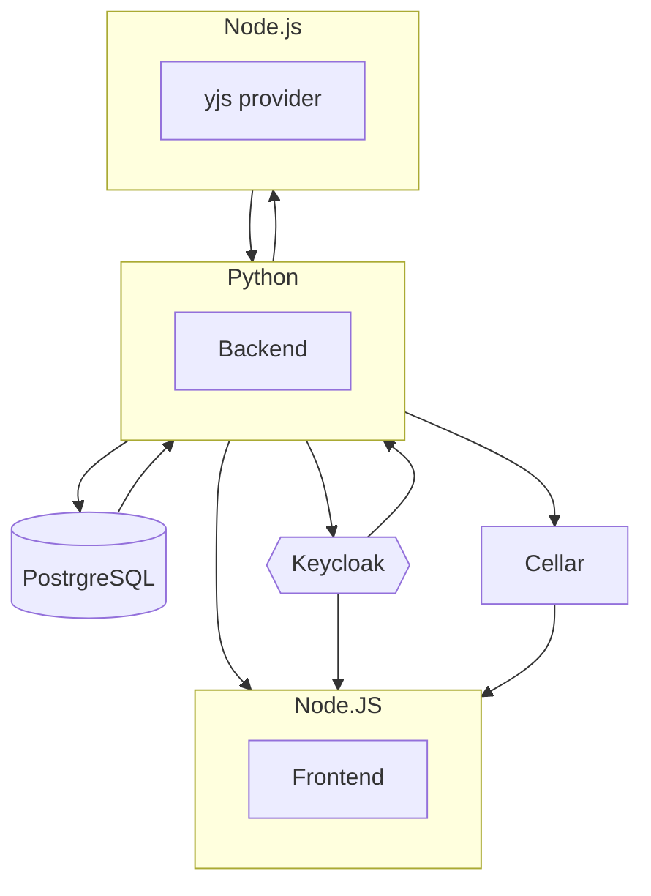


  The open source document editor where your notes can become knowledge through live collaboration.


## Docs architecture overview

[Docs](https://github.com/suitenumerique/docs) runs on a Python backend and displays the application on a React/Next frontend. A [yjs provider](https://github.com/yjs/yjs) completes the stack to enable collaborative features.



## Deploy Docs

Docs runs using:

- a **Python** application for the backend (in `src/backend`)
- a **Node.js** application for the frontend (in `src/frontend`)
- a **Node.js** application for the y-provider (in `src/frontend/servers/y-provider`)

This guide walks you trough a deployment from the root of [Docs repository](https://github.com/suitenumerique/docs). Clone the repository and follow the steps to deploy Docs with a minimal configuration.

### Deploy the backend

{}

#### Create a Python application

Select at least an `XS` plan. Smaller instances can make the build to fail.

Inject the following environment variables

```env
APP_FOLDER="/src/backend"
CC_PRE_BUILD_HOOK="cd src/backend && pip install pip-tools && pip-compile pyproject.toml &&
pip-sync requirements.txt"
CC_PYTHON_MODULE="impress.wsgi:application"
CC_PYTHON_VERSION="3"
CC_RUN_SUCCEEDED_HOOK="cd src/backend && python manage.py migrate"
DATA_DIR="home/bas/<app_id>/src/backend/data"
DJANGO_CONFIGURATION="Production"
DJANGO_SECRET_KEY="<your-key>"
DJANGO_SETTINGS_MODULE="impress.settings"
DJANGO_SUPERUSER_PASSWORD="<your-password>"
```

#### Create a PosgreSQL add-on

Inject the DB credentials into the Python application:

```env
DB_HOST="<postrgresql_addon_host_value>"
DB_NAME="<postrgresql_addon_name_value>"
DB_PASSWORD="<postrgresql_addon_password_value>"
DB_PORT="<postrgresql_addon_port_value>"
DB_USER="<postrgresql_addon_user_value>"
```

#### Set the backend domain name

Select **Domain names** and add use the path routing feature on Clever Cloud to set the domain ans follows:

- Domain name: `<docs-base-domain>`
- Route: `/api/v1.0/`

**⚠️ Don't skip the trailing slash at the end of the route.**

You can use `.cleverapps.io` domains for tests. Make sure to set a custom domain before releasing for production.

Then, inject the following environment variables:

```env
DJANGO_ALLOWED_HOSTS="<docs-base-domain>"
DJANGO_CSRF_TRUSTED_ORIGINS="https://<docs-base-domain>"
IMPRESS_BASE_URL="https://<docs-base-domain>"
LOGIN_REDIRECT_URL="https://<docs-base-domain>"
LOGOUT_REDIRECT_URL="https://<docs-base-domain>/*"
```

#### Push your code

If you push using git, add the remote as `clever-backend`, for example.

{}

### Deploy the frontend

{}

#### Create a Node.js application

Select at least a `M` instance for the build, and inject the following environment variables:

```env
APP_FOLDER="./src/frontend"
CC_NODE_BUILD_TOOL="yarn"
CC_PRE_BUILD_HOOK="cd ./src/frontend && yarn install --frozen-lockfile && yarn app:build"
CC_RUN_COMMAND="cd ./src/frontend && yarn app:start"
NEXT_PUBLIC_API_BASE_PATH="/"
NEXT_PUBLIC_SW_DEACTIVATED="true"
NODE_OPTIONS="--max-old-space-size=4096"
```

#### Set the frontend domain name

- Select **Domain names** and set the base domain for Docs. The frontend doesn't need any route.
- Add the domain to the environment variables: inject `NEXT_PUBLIC_API_ORIGIN="https://<docs-base-domain>"` to the list of the frontend environment variables.

#### Push your code

If you push using git, add the remote as `clever-frontend`, for example.

{}

### Deploy the y-provider

{}

#### Create a Node.js application

Inject the following environment variables:

```env
APP_FOLDER="/src/frontend/servers/y-provider"
CC_NODE_BUILD_TOOL="yarn"
CC_PRE_BUILD_HOOK="cd ./src/frontend/servers/y-provider && yarn install --frozen-lockfile && yarn build"
CC_RUN_COMMAND="cd ./src/frontend/servers/y-provider && yarn start"
COLLABORATION_LOGGING="true"
COLLABORATION_SERVER_ORIGIN="https://<docs-base-domain>"
COLLABORATION_SERVER_SECRET="<server-secret>"
Y_PROVIDER_API_KEY="<generated-api-key>"
```

#### Set y-provider domain

Select **Domain names** and add the following domains:

- Domain: `<docs-base-domain>`
- Route: `/collaboration/api/`

- Domain: `<docs-base-domain>`
- Route: `/ws/`

#### Connect to the backend

Select **Exposed configuration** and inject the following environment variables:

```env
COLLABORATION_API_URL="https://<docs-base-domain>/collaboration/api/"
COLLABORATION_SERVER_SECRET="<server-secret>"
```

Then select the **backend** application > **Service dependencies** > **Link applications** and choose the y-provider application.

#### Push your code

If you push using git, add the remote as `clever-y-provider`, for example.

{}

## How to configure Docs

Docs depends on some services that needs configuration before it can function. Use the **Create > an add-on** function to create each dependency on Clever Cloud.

### Keycloak

Docs uses Keycloak as an authentication provider. Configure it by following these steps:

{}

#### Create a Keycloak add-on

If you don't have a Keycloak instance, create one on Clever Cloud. If you already have one, skip this step. For the sake of demonstration, this guide follows [the example values provided by Docs](https://github.com/suitenumerique/docs/blob/main/docs/examples/impress.values.yaml). You can rename them as you see fit.

#### Create a new realm

Name it `impress`.

#### Create a new client

Name it `impress` as well.

#### Client settings

##### General settings

- Client ID: impress
- Client name: impress
- Always Display in UI: ON

##### Access settings

- Root URL: `https://<docs-base-domain>`
- Home URL: `https://<docs-base-domain>`
- Valid redirect URIs: `https://<docs-base-domain>/api/v1.0/callback/*`
- Valid post logout redirect URIs: `https://<docs-base-domain>/*`
- Web origins: `https://<docs-base-domain>`

##### Capability config

- Client authentication: On
- Authorization: Off
- Authentication flow: Standard flow

##### Find the Client Secret

Find it in **Clients > impress > credentials**, named **Client secret*.

##### Optional : Add an identity provider

You can choose among different identity providers (GitHub, Google, etc, and even Clever Cloud).

#### Inject the variables in the **backend** application

```env
OIDC_OP_AUTHORIZATION_ENDPOINT="https://<cc_keycloak_hostname_value>/realms/impress/protocol/openid-connect/auth"
OIDC_OP_JWKS_ENDPOINT="https://<cc_keycloak_hostname_value>/realms/impress/protocol/openid-connect/certs"
OIDC_OP_LOGOUT_ENDPOINT="https://<cc_keycloak_hostname_value>/realms/impress/protocol/openid-connect/session/end"
OIDC_OP_TOKEN_ENDPOINT="https://<cc_keycloak_hostname_value>/realms/impress/protocol/openid-connect/token"
OIDC_OP_USER_ENDPOINT="https://<cc_keycloak_hostname_value>/realms/impress/protocol/openid-connect/userinfo"
OIDC_RP_CLIENT_ID="impress"
OIDC_RP_CLIENT_SECRET="<client-secret>"
OIDC_RP_SCOPES="openid email"
OIDC_RP_SIGN_ALGO="RS256"
```

{}

### Redis

Create a Redis add-on, but don't connect it to the application, since Docs requires an URI format that differs from the one provided by Clever Cloud. Instead, inject the variable in the **backend** application, using this format: `REDIS_URL="redis://default:<redis_password>:<redis_host>:<redis_port>"`

### Cellar

Docs uses s3 compatible storage to store uploaded files by users.

{}

#### Create a Cellar add-on

#### Create a bucket

#### Inject the variables in the **backend** application

```env
AWS_S3_ACCESS_KEY_ID="<cellar-addon_key_id_value>"
AWS_S3_ENDPOINT_URL="<cellar-addon_host_value>"
AWS_S3_REGION_NAME="auto"
AWS_S3_SECRET_ACCESS_KEY="<cellar-addon_key_secret_value>"
AWS_STORAGE_BUCKET_NAME="<name-of-your-bucket>"
AWS_REQUEST_CHECKSUM_CALCULATION="when_required"
AWS_RESPONSE_CHECKSUM_VALIDATION="when_required"
```

{}

## 🎓 Further Help


  
