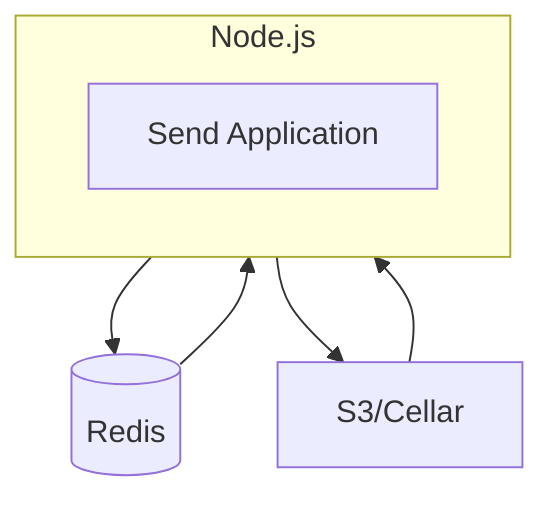


  Simple, private file sharing. A fork of Mozilla's Firefox Send that allows you to encrypt and send files with links that automatically expire.


## Send architecture overview

[Send](https://github.com/timvisee/send) is a Node.js application providing secure file sharing with automatic expiration. It uses Redis for metadata storage and supports multiple storage backends including local filesystem, S3-compatible services, and Google Cloud Storage.



## Prerequisites

Before deploying Send on Clever Cloud, make sure you have:

- **Node.js 16.x**
- **Redis** for metadata storage
- **Cellar S3** for file storage
- **Clever Tools CLI** ([documentation](/developers/doc/cli/))
- **s3cmd** for bucket management
- **Git**

## Installation and deployment

### 1. Clone and prepare the Send repository

Clone the Send repository and prepare it for deployment:

```bash
# Clone the Send repository
git clone https://github.com/timvisee/send.git
cd send
```

### 2. Create and configure Redis add-on

Create a Redis add-on first for metadata storage:

```bash
# Create Redis addon
clever addon create redis-addon --plan s_mono send-redis
```

### 3. Create and configure Cellar S3 storage

Create the Cellar S3 addon for file storage:

```bash
# Create Cellar addon
clever addon create cellar-addon --plan S send-storage
```

and configure a bucket for send "send-storage-bucket"

Check the docs for more information https://www.clever-cloud.com/developers/doc/addons/cellar/

### 4. Create and configure Node.js application

Create the Node.js application on Clever Cloud:

```bash
# Create the Node.js app on Clever Cloud
clever create --type node send-app

# Link Redis addon to the application
clever service link-addon send-redis

# Link Cellar addon to the application
clever service link-addon send-storage
```

Set Node.js version and basic configuration:

```bash
# Set Node.js version and environment
clever env set CC_NODE_VERSION 16
clever env set PORT 8080
clever env set CC_POST_BUILD_HOOK "npm install && npm install -g rimraf && npm run build"
```

### 5. Configure environment variables

First, get the IDs of the addons with `clever addon`.

Set Redis connection environment variables:

```bash
# Redis configuration
clever env set REDIS_DB 0
```

All other variables are configured automatically.

Configure S3/Cellar storage (replace with actual values from `clever addon env <addon_id>`):

```bash
# S3/Cellar configuration
clever env set S3_BUCKET send-storage-bucket
clever env set S3_ENDPOINT <CELLAR_ADDON_HOST>
clever env set AWS_ACCESS_KEY_ID <CELLAR_ADDON_KEY_ID>
clever env set AWS_SECRET_ACCESS_KEY <CELLAR_ADDON_KEY_SECRET>
clever env set S3_USE_PATH_STYLE_ENDPOINT true
```

Set Send application configuration:

get the current testing domain with `clever domain`, then

```bash
# Base URL (replace with your test domain)
clever env set BASE_URL https://<your-test-domain>.cleverapps.io

# File upload limits
clever env set MAX_FILE_SIZE 2147483648
clever env set MAX_FILES_PER_ARCHIVE 64
clever env set MAX_ARCHIVES_PER_USER 16

# Download and expiration settings
clever env set DEFAULT_EXPIRE_SECONDS 86400
clever env set MAX_EXPIRE_SECONDS 604800
clever env set DEFAULT_DOWNLOADS 1
clever env set MAX_DOWNLOADS 100

# UI dropdown options
clever env set DOWNLOAD_COUNTS "1,5,10,25,50,100"
clever env set EXPIRE_TIMES_SECONDS "3600,86400,604800,2592000"
```

### 6. Deploy the application

Deploy your Send application:

```bash

# Deploy to Clever Cloud
clever deploy
```

### 7. Set up custom domain (optional)

If you want to use a custom domain:

```bash
# Add your custom domain
clever domain add <your-custom-domain.com>

# Update the BASE_URL environment variable
clever env set BASE_URL https://<your-custom-domain.com>

# Restart to apply new BASE_URL
clever restart
```

## Alternative configurations

### Custom branding (optional)

Customize the appearance of your Send instance:

```bash
# Custom branding
clever env set UI_COLOR_PRIMARY "#ff6600"
clever env set UI_COLOR_ACCENT "#cc5200"
clever env set CUSTOM_TITLE "My Send Instance"
clever env set CUSTOM_DESCRIPTION "Secure file sharing for our organization"
clever env set CUSTOM_FOOTER_TEXT "Powered by Send"
clever env set CUSTOM_FOOTER_URL "https://example.com"
```

## Common issues

**1. Redis connection failed:**
- Verify Redis addon is linked: `clever service`
- Check Redis environment variables: `clever env | grep REDIS`

**2. S3 upload fails:**
- Verify bucket exists: `s3cmd ls`
- Check S3 environment variables: `clever env | grep -E "(S3_|AWS_)"`
- Verify bucket policy: `s3cmd info s3://your-bucket`

**3. Application won't start:**
- Check logs: `clever logs`
- Verify all required environment variables are set: `clever env`
- Restart application: `clever restart`

## 🎓 Further Help


  
  
  
  

